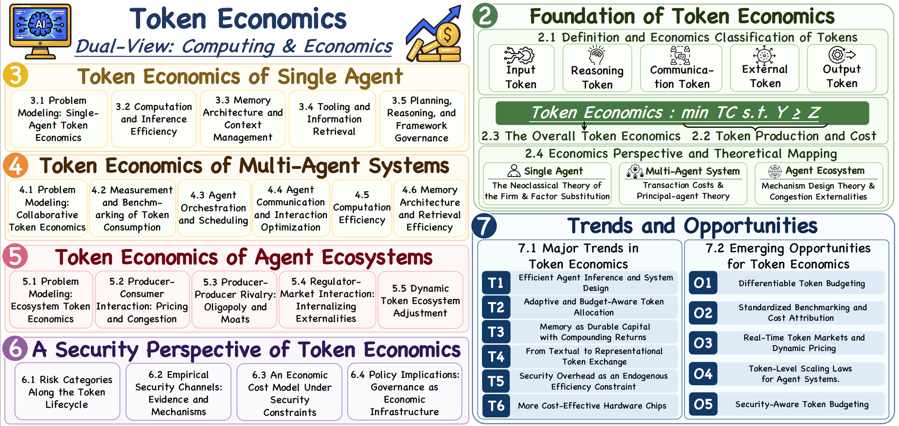
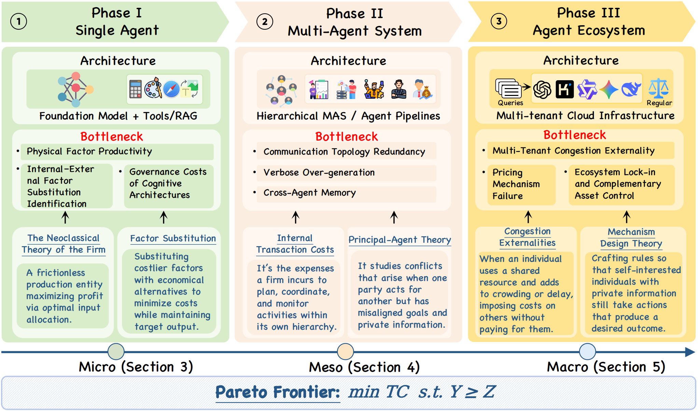
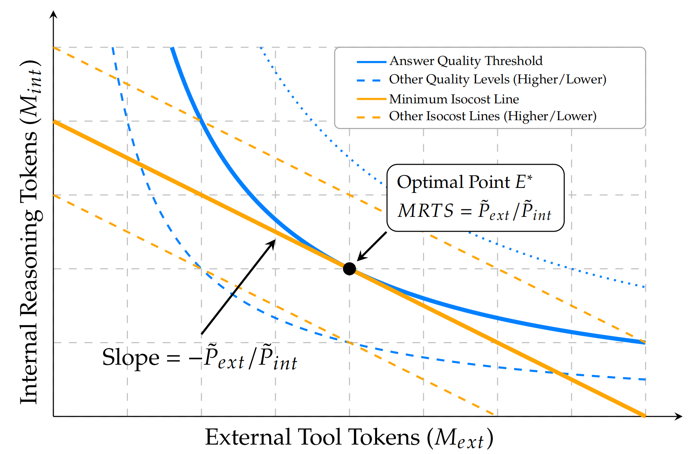
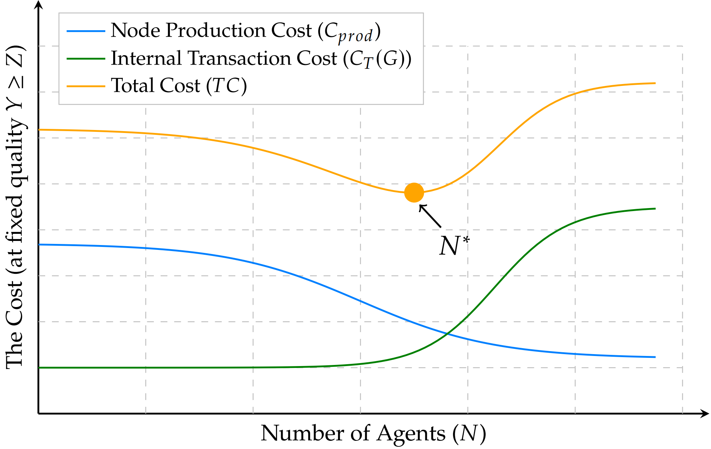
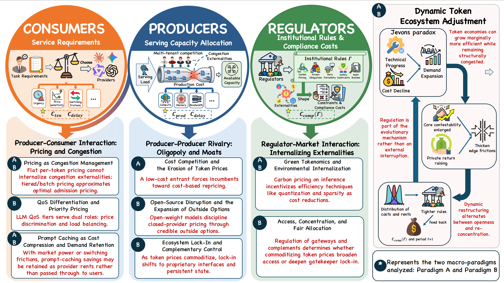
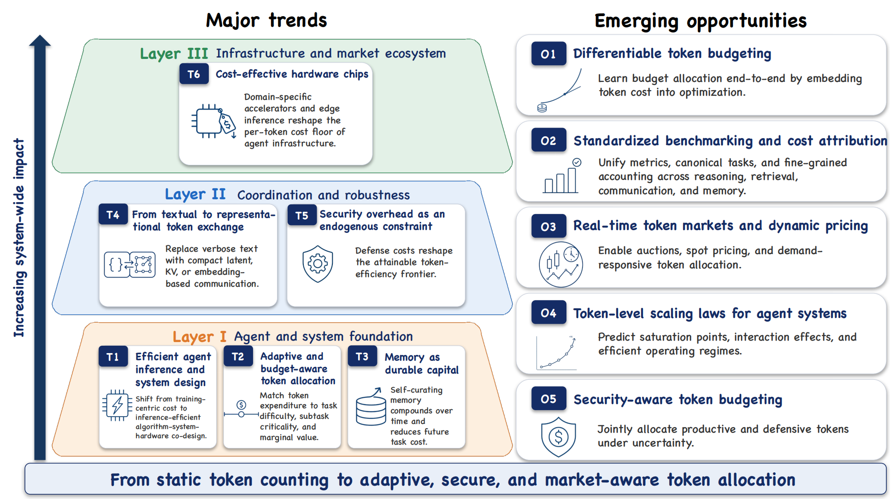

# Awesome Token Economics for LLM Agents

<div align="center">

[](https://awesome.re)
[](http://makeapullrequest.com)
[](#-introduction)
[](#-introduction)

**A living literature repository for _Token Economics for LLM Agents: A Dual-View Study from Computing and Economics_.**

</div>

---

## 📖 Introduction
<p align="center">
  
</p>

This repository organizes the literature behind our survey **by chapter-level research structure**, covering token economics from **foundations**, **single-agent optimization**, **multi-agent coordination**, **ecosystem dynamics**, **security economics**, and **future opportunities**.

It is designed as a **living literature repository**: instead of a static bibliography, it serves as a continuously maintainable index of papers, grouped according to the analytical framework of the survey.

<!-- **Literature sources used in this repository**
- Survey structure: `content/1-intro_condensed.tex`, `content/3-single-agent_condensed.tex`, `content/4-multi-agent_condensed.tex`, `content/5-ecosystem_condensed.tex`, `content/6-security_condensed.tex`, and `content/7-future_condensed.tex`
- Structured citation grouping: `tables/all.tex`, `tables/tab_single_agent.tex`, `tables/tab_mas_mapping.tex`, `tables/tab_security_refs.tex`, and `tables/tab_token_factories.tex`
- Bibliographic metadata: `main.bib` and `sample-base.bib` (the actual survey-specific entries are primarily resolved from `main.bib`) -->

---

## 📰 News

- **2026-05-11**: Initialized the first README-based living literature index for the Token Economics survey.
- Future updates will add new papers, code links, and refined sub-taxonomies.

<!-- ---

## 📄 Survey Paper

- **Title**: _Token Economics for LLM Agents: A Dual-View Study from Computing and Economics_
- **Manuscript Source**: `main.tex`
- **Scope**: Foundations → Single-Agent → Multi-Agent → Ecosystem → Security → Trends
- **Repository Role**: A companion literature index for GitHub-based browsing and long-term maintenance

> If you later publish the paper on arXiv or a project page, replace this section with the public links and update the survey badge accordingly. -->

---

## 🧭 Taxonomy

We organize the literature using the same logic as the survey:

- **Related Surveys**
- **Foundations of Token Economics**
- **Token Economics of the Single Agent**
- **Token Economics in Multi-Agent Systems**
- **Token Economics of Intelligent Agent Ecosystems**
- **A Security Perspective on Token Economics**
- **Trends and Opportunities**

---

## 📑 Table of Contents

- [Related Surveys](#-related-surveys)
- [Foundations of Token Economics](#-foundations-of-token-economics)
- [Token Economics of the Single Agent](#-token-economics-of-the-single-agent)
- [Token Economics in Multi-Agent Systems](#multi-agent-token)
- [Token Economics of Intelligent Agent Ecosystems](#-token-economics-of-intelligent-agent-ecosystems)
- [A Security Perspective on Token Economics](#security-perspective)
- [Trends and Opportunities](#-trends-and-opportunities)
<!-- - [Contributing](#-contributing) -->
- [Citation](#-citation)
- [Star History](#-star-history)

---

## 📚 Related Surveys

| Paper | Authors | Venue | Year | Links |
|:--|:--|:--:|:--:|:--:|
| **A survey on LLM-based multi-agent systems: workflow, infrastructure, and challenges** | Li et al. | Vicinagearth | 2024 | [Paper](https://link.springer.com/article/10.1007/s44336-024-00009-2) |
| **The rise and potential of large language model based agents: A survey** | Xi et al. | Science China Information Sciences | 2025 | [Paper](https://link.springer.com/article/10.1007/s11432-024-4222-0) |
| **Towards efficient generative large language model serving: A survey from algorithms to systems** | Miao et al. | ACM Computing Surveys | 2025 | [Paper](https://dl.acm.org/doi/full/10.1145/3754448) |
| **Resource-efficient algorithms and systems of foundation models: A survey** | Xu et al. | ACM Computing Surveys | 2025 | [Paper](https://dl.acm.org/doi/full/10.1145/3706418) |
| **AI agents under threat: A survey of key security challenges and future pathways** | Deng et al. | ACM Computing Surveys | 2025 | [Paper](https://dl.acm.org/doi/full/10.1145/3716628) |
| **The emerged security and privacy of llm agent: A survey with case studies** | He et al. | ACM Computing Surveys | 2025 | [Paper](https://dl.acm.org/doi/full/10.1145/3773080) |

## 🧠 Foundations of Token Economics
<p align="center">
  
</p>

| Paper | Authors | Venue | Year | Links |
|:--|:--|:--:|:--:|:--:|
| **A theory of the dynamics of factor shares** | Boldrin et al. | Journal of Monetary Economics | 2024 | [Paper](https://www.sciencedirect.com/science/article/abs/pii/S0304393224000631) |
| **Real effects of supplying safe private money** | Xu and He| Journal of Financial Economics | 2024 | [Paper](https://www.sciencedirect.com/science/article/abs/pii/S0304405X24000916) |
| **Understanding money using historical evidence** | Brzezinski et al. | Annual Review of Economics | 2024 | [Paper](https://www.annualreviews.org/content/journals/10.1146/annurev-economics-091923-040328) |
| **Tutoring Efficacy, Household Substitution, And Student Achievement: Experimental Evidence From An After-School Tutoring Program In Rural China** | Behrman et al. | International Economic Review | 2024 | [Paper](https://onlinelibrary.wiley.com/doi/abs/10.1111/iere.12668) |
| **Testing the production approach to markup estimation** | Raval | Review of Economic Studies | 2023 | [Paper](https://academic.oup.com/restud/article-abstract/90/5/2592/6987701) |
| **Toolformer: Language Models Can Teach Themselves to Use Tools** | Schick et al. | Advances in Neural Information Processing Systems | 2023 | [Paper](https://proceedings.neurips.cc/paper_files/paper/2023/hash/d842425e4bf79ba039352da0f658a906-Abstract-Conference.html) |
| **The Neoclassical Theory of Firm Investment and Taxes: A Reassessment** | Chodorow-Reich | National Bureau of Economic Research | 2025 | [Paper](https://www.nber.org/papers/w33922) |
| **Not a Typical Firm: Capital--Labor Substitution and Firms' Labor Shares** | Hubmer and Restrepo | American Economic Journal: Macroeconomics | 2026 | [Paper](https://www.aeaweb.org/articles?id=10.1257/mac.20230325) |
| **MasRouter: Learning to Route LLMs for Multi-Agent Systems** | Yue, Yanwei et al. | Proceedings of the Annual Meeting of the Association for Computational Linguistics | 2025 | [Paper](https://aclanthology.org/2025.acl-long.757/) |
| **Firm performance in digitally integrated supply chains: a combined perspective of transaction cost economics and relational exchange theory** | Patil et al. | Journal of Enterprise Information Management | 2024 | [Paper](https://www.emerald.com/jeim/article-abstract/37/2/381/1237687/Firm-performance-in-digitally-integrated-supply?redirectedFrom=fulltext) |
| **Principal-agent VCG contracts** | Lavi, Ron and Shamash, Elisheva S | Journal of Economic Theory | 2022 | [Paper](https://www.sciencedirect.com/science/article/abs/pii/S0022053122000333) |
| **Stablefees: A predictable fee market for cryptocurrencies** | Basu et al. | Management Science | 2023 | [Paper](https://pubsonline.informs.org/doi/abs/10.1287/mnsc.2023.4735) |
| **A theory of simplicity in games and mechanism design** | Pycia and Troyan | Econometrica | 2023 | [Paper](https://onlinelibrary.wiley.com/doi/full/10.3982/ECTA16310) |
| **Variety-based congestion in online markets: Evidence from mobile apps** | Ershov | American Economic Journal: Microeconomics | 2024 | [Paper](https://www.aeaweb.org/articles?id=10.1257/mic.20200347) |

## 🤖 Token Economics of the Single Agent
<p align="center">
  
</p>

### Computation and Inference Efficiency

| Paper | Authors | Venue | Year | Links |
|:--|:--|:--:|:--:|:--:|
| **A neural probabilistic language model** | Bengio et al | Journal of machine learning research | 2003 | [Paper]() |
| **Efficient estimation of word representations in vector space** | Mikolov et al. | International Conference on Learning Representations Workshop | 2013 | [Paper](https://arxiv.org/abs/1301.3781) |
| **Glove: Global vectors for word representation** | Pennington et al. | Proceedings of the conference on empirical methods in natural language processing | 2014 | [Paper](https://aclanthology.org/D14-1162.pdf) |
| **Neural machine translation of rare words with subword units** | Sennrich et al. | Proceedings of the annual meeting of the association for computational linguistics | 2016 | [Paper](https://aclanthology.org/P16-1162.pdf) |
| **SentencePiece: A simple and language independent subword tokenizer and detokenizer for neural text processing** | Kudo and Richardson | Proceedings of the conference on empirical methods in natural language processing: System demonstrations | 2018 | [Paper](https://aclanthology.org/D18-2012/) |
| **Neural Discrete Representation Learning** | van den Oord | Advances in Neural Information Processing Systems | 2017 | [Paper](https://proceedings.neurips.cc/paper/2017/hash/7a98af17e63a0ac09ce2e96d03992fbc-Abstract.html) |
| **Generating Diverse High-Fidelity Images with VQ-VAE-2** | Razavi et al. | Advances in Neural Information Processing Systems | 2019 | [Paper](https://proceedings.neurips.cc/paper/2019/hash/5f8e2fa1718d1bbcadf1cd9c7a54fb8c-Abstract.html) |
| **Compressed chain of thought: Efficient reasoning through dense representations** | Cheng and Van Durme | arXiv preprint arXiv:2412.13171 | 2024 | [Paper](https://arxiv.org/abs/2412.13171) |
| **CODI: Compressing Chain-of-Thought into Continuous Space via Self-Distillation** | Shen et al. | Proceedings of the Conference on Empirical Methods in Natural Language Processing | 2025 | [Paper](https://aclanthology.org/2025.emnlp-main.36/) |
| **R1-Compress: Long Chain-of-Thought Compression via Chunk Compression and Search** | Wang et al. | arXiv preprint arXiv:2505.16838 | 2025 | [Paper](https://arxiv.org/abs/2505.16838) |
| **TokenSkip: Controllable Chain-of-Thought Compression in LLMs** | Xia et al. | Proceedings of the Conference on Empirical Methods in Natural Language Processing | 2025 | [Paper](https://aclanthology.org/2025.emnlp-main.165/) |
| **Training Large Language Models to Reason in a Continuous Latent Space** | Hao et al. | Second Conference on Language Modeling | 2025 | [Paper](https://arxiv.org/abs/2412.06769) |
| **Dynamic Early Exit in Reasoning Models** | Yang et al. | International Conference on Learning Representations | 2026 | [Paper](https://arxiv.org/abs/2504.15895) |
| **FlashThink: An Early Exit Method For Efficient Reasoning** | Jiang et al. | arXiv preprint arXiv:2505.13949 | 2025 | [Paper](https://arxiv.org/abs/2505.13949) |
| **FlashAttention: Fast and Memory-Efficient Exact Attention with IO-Awareness** | Dao et al. | Advances in Neural Information Processing Systems | 2022 | [Paper](https://proceedings.neurips.cc/paper_files/paper/2022/hash/67d57c32e20fd0a7a302cb81d36e40d5-Abstract-Conference.html?utm_source=chatgpt.com) |
| **Big Bird: Transformers for Longer Sequences** | Zaheer et al. | Advances in Neural Information Processing Systems | 2020 | [Paper](https://proceedings.neurips.cc/paper/2020/hash/c8512d142a2d849725f31a9a7a361ab9-Abstract.html) |
| **Transformers are RNNs: Fast Autoregressive Transformers with Linear Attention** | Katharopoulos et al. | Proceedings of the International Conference on Machine Learning | 2020 | [Paper](https://proceedings.mlr.press/v119/katharopoulos20a.html?ref=mackenziemorehead.com) |
| **SnapKV: LLM Knows What You are Looking for Before Generation** | Li et al. | Advances in Neural Information Processing Systems | 2024 | [Paper](https://proceedings.neurips.cc/paper_files/paper/2024/hash/28ab418242603e0f7323e54185d19bde-Abstract-Conference.html) |
| **H2O: Heavy-Hitter Oracle for Efficient Generative Inference of Large Language Models** | Zhang et al. | Advances in Neural Information Processing Systems | 2023 | [Paper](https://proceedings.neurips.cc/paper_files/paper/2023/hash/6ceefa7b15572587b78ecfcebb2827f8-Abstract-Conference.html) |
| **OPTQ: Accurate Quantization for Generative Pre-trained Transformers** | Frantar et al. | International Conference on Learning Representations | 2023 | [Paper](https://iclr.cc/virtual/2023/poster/10855) |
| **Movement Pruning: Adaptive Sparsity by Fine-Tuning** | Sanh et al. | Advances in Neural Information Processing Systems | 2020 | [Paper](https://proceedings.neurips.cc/paper_files/paper/2020/hash/eae15aabaa768ae4a5993a8a4f4fa6e4-Abstract.html) |
| **Switch Transformers: Scaling to Trillion Parameter Models with Simple and Efficient Sparsity** | Fedus et al. | Journal of Machine Learning Research | 2022 | [Paper](https://www.jmlr.org/papers/v23/21-0998.html) |
| **St-moe: Designing stable and transferable sparse expert models** | Zoph et al. | arXiv preprint arXiv:2202.08906 | 2022 | [Paper](https://arxiv.org/abs/2202.08906) |
| **Fast Inference from Transformers via Speculative Decoding** | Leviathan et al. | Proceedings of the International Conference on Machine Learning | 2023 | [Paper](https://proceedings.mlr.press/v202/leviathan23a) |
| **Draft & Verify: Lossless Large Language Model Acceleration via Self-Speculative Decoding** | Zhang et al. | Proceedings of the Annual Meeting of the Association for Computational Linguistics | 2024 | [Paper](https://aclanthology.org/2024.acl-long.607.pdf) |

### Memory Architecture and Context Management

| Paper | Authors | Venue | Year | Links |
|:--|:--|:--:|:--:|:--:|
| **LLMLingua: Compressing Prompts for Accelerated Inference of Large Language Models** | Jiang et al. | Proceedings of the Conference on Empirical Methods in Natural Language Processing | 2023 | [Paper](https://aclanthology.org/2023.emnlp-main.825/) |
| **LongLLMLingua: Accelerating and Enhancing LLMs in Long Context Scenarios via Prompt Compression** | Jiang et al. | Proceedings of the Annual Meeting of the Association for Computational Linguistics | 2024 | [Paper](https://aclanthology.org/2024.acl-long.91/) |
| **Learning to Compress Prompts with Gist Tokens** | Mu et al. | Advances in Neural Information Processing Systems | 2023 | [Paper](https://proceedings.neurips.cc/paper_files/paper/2023/hash/3d77c6dcc7f143aa2154e7f4d5e22d68-Abstract-Conference.html) |
| **Adapting Language Models to Compress Contexts** | Chevalier et al. | Proceedings of the Conference on Empirical Methods in Natural Language Processing | 2023 | [Paper](https://aclanthology.org/2023.emnlp-main.232/) |
| **Compressing Context to Enhance Inference Efficiency of Large Language Models** | Li et al. | Proceedings of the Conference on Empirical Methods in Natural Language Processing | 2023 | [Paper](https://aclanthology.org/2023.emnlp-main.391/) |
| **MemGPT: Towards LLMs as Operating Systems** | Packer et al. | arXiv preprint arXiv:2310.08560 | 2024 | [Paper](https://par.nsf.gov/servlets/purl/10524107) |
| **Generative Agents: Interactive Simulacra of Human Behavior** | Park et al. | Proceedings of the Annual ACM Symposium on User Interface Software and Technology | 2023 | [Paper](https://dl.acm.org/doi/abs/10.1145/3586183.3606763) |
| **Reflexion: language agents with verbal reinforcement learning** | Shinn et al. | Advances in Neural Information Processing Systems | 2023 | [Paper](https://proceedings.neurips.cc/paper_files/paper/2023/hash/1b44b878bb782e6954cd888628510e90-Abstract-Conference.html) |
| **MemoryBank: Enhancing Large Language Models with Long-Term Memory** | Zhong et al. | Proceedings of the AAAI Conference on Artificial Intelligence | 2024 | [Paper](https://ojs.aaai.org/index.php/AAAI/article/view/29946) |
| **A-mem: Agentic memory for llm agents** | Xu et al. | Advances in Neural Information Processing Systems | 2026 | [Paper](https://proceedings.neurips.cc/paper_files/paper/2025/hash/19909c36f51abc4856b4560aff3d36d6-Abstract-Conference.html) |
| **Mem0: Building Production-Ready AI Agents with Scalable Long-Term Memory** | Chhikara et al. | Proceedings of the European Conference on Artificial Intelligence | 2025 | [Paper](https://arxiv.org/abs/2504.19413) |

### Tooling and Information Retrieval

| Paper | Authors | Venue | Year | Links |
|:--|:--|:--:|:--:|:--:|
| **Toolformer: Language Models Can Teach Themselves to Use Tools** | Schick et al. | Advances in Neural Information Processing Systems | 2023 | [Paper](https://proceedings.neurips.cc/paper_files/paper/2023/hash/d842425e4bf79ba039352da0f658a906-Abstract-Conference.html) |
| **Gorilla: Large Language Model Connected with Massive APIs** | Patil et al. | Advances in Neural Information Processing Systems | 2024 | [Paper](https://proceedings.neurips.cc/paper_files/paper/2024/hash/e4c61f578ff07830f5c37378dd3ecb0d-Abstract-Conference.html) |
| **ToolLLM: Facilitating Large Language Models to Master 16000+ Real-world APIs** | Qin et al. | International Conference on Learning Representations | 2024 | [Paper](https://proceedings.iclr.cc/paper_files/paper/2024/hash/28e50ee5b72e90b50e7196fde8ea260e-Abstract-Conference.html) |
| **AnyTool: Self-Reflective, Hierarchical Agents for Large-Scale API Calls** | Du et al. | Proceedings of the International Conference on Machine Learning | 2024 | [Paper](https://arxiv.org/abs/2402.04253) |
| **ToolRL: Reward is All Tool Learning Needs** | Qian et al. | Advances in Neural Information Processing Systems | 2025 | [Paper](https://proceedings.neurips.cc/paper_files/paper/2025/hash/97c5b2707228e7e3fb67e4ecc2e0e607-Abstract-Conference.html) |
| **Model Context Protocol (MCP): Landscape, Security Threats, and Future Research Directions** | Hou et al. | ACM Transactions on Software Engineering and Methodology | 2026 | [Paper](https://dl.acm.org/doi/abs/10.1145/3796519) |
| **Self-RAG: Learning to Retrieve, Generate, and Critique through Self-Reflection** | Asai et al. | International Conference on Learning Representations | 2024 | [Paper](https://proceedings.iclr.cc/paper_files/paper/2024/hash/25f7be9694d7b32d5cc670927b8091e1-Abstract-Conference.html) |
| **Corrective Retrieval Augmented Generation** | Yan et al. | arXiv preprint arXiv:2401.15884 | 2024 | [Paper](https://openreview.net/forum?id=JnWJbrnaUE) |
| **Adaptive-RAG: Learning to Adapt Retrieval-Augmented Large Language Models through Question Complexity** | Jeong et al. | Proceedings of the Conference of the North American Chapter of the Association for Computational Linguistics: Human Language Technologies | 2024 | [Paper](https://aclanthology.org/2024.naacl-long.389/) |
| **From Local to Global: A Graph RAG Approach to Query-Focused Summarization** | Edge et al. | arXiv preprint arXiv:2404.16130 | 2024 | [Paper](https://arxiv.org/abs/2404.16130) |
| **RAPTOR: Recursive Abstractive Processing for Tree-Organized Retrieval** | Sarthi et al. | International Conference on Learning Representations | 2024 | [Paper](https://proceedings.iclr.cc/paper_files/paper/2024/hash/8a2acd174940dbca361a6398a4f9df91-Abstract-Conference.html) |
| **Precise Zero-Shot Dense Retrieval without Relevance Labels** | Gao et al. | Proceedings of the Annual Meeting of the Association for Computational Linguistics | 2023 | [Paper](https://aclanthology.org/2023.acl-long.99/) |
| **A-RAG: Scaling Agentic Retrieval-Augmented Generation via Hierarchical Retrieval Interfaces** | Du et al. | arXiv preprint arXiv:2602.03442 | 2026 | [Paper](https://arxiv.org/abs/2602.03442) |

### Planning, Reasoning, and Framework Governance

| Paper | Authors | Venue | Year | Links |
|:--|:--|:--:|:--:|:--:|
| **Chain-of-Thought Prompting Elicits Reasoning in Large Language Models** | Wei et al. | Advances in Neural Information Processing Systems | 2022 | [Paper](https://proceedings.neurips.cc/paper/2022/hash/9d5609613524ecf4f15af0f7b31abca4-Abstract-Conference.html) |
| **ReAct: Synergizing Reasoning and Acting in Language Models** | Yao et al. | International Conference on Learning Representations | 2023 | [Paper](https://arxiv.org/abs/2210.03629) |
| **Tree of Thoughts: Deliberate Problem Solving with Large Language Models** | Yao et al. | Advances in Neural Information Processing Systems | 2023 | [Paper](https://proceedings.neurips.cc/paper/2023/hash/271db9922b8d1f4dd7aaef84ed5ac703-Abstract.html) |
| **Graph of Thoughts: Solving Elaborate Problems with Large Language Models** | Besta et al. | Proceedings of the AAAI Conference on Artificial Intelligence | 2024 | [Paper](https://ojs.aaai.org/index.php/AAAI/article/view/29720) |
| **Language Agent Tree Search Unifies Reasoning, Acting, and Planning in Language Models** | Zhou et al. | Proceedings of the International Conference on Machine Learning | 2024 | [Paper](https://arxiv.org/abs/2310.04406) |
| **Spend Less, Reason Better: Budget-Aware Value Tree Search for LLM Agents** | Li et al. | arXiv preprint arXiv:2603.12634 | 2026 | [Paper](https://arxiv.org/abs/2603.12634) |
| **Plan-and-Solve Prompting: Improving Zero-Shot Chain-of-Thought Reasoning by Large Language Models** | Wang et al. | Proceedings of the Annual Meeting of the Association for Computational Linguistics | 2023 | [Paper](https://aclanthology.org/2023.acl-long.147/) |
| **Cognitive Architectures for Language Agents** | Sumers, Theodore R. et al. | Transactions on Machine Learning Research | 2024 | [Paper](https://openreview.net/forum?id=1i6ZCvflQJ) |
| **Voyager: An Open-Ended Embodied Agent with Large Language Models** | Wang et al. | Advances in Neural Information Processing Systems | 2023 | [Paper](https://arxiv.org/abs/2305.16291) |
| **SWE-agent: Agent-Computer Interfaces Enable Automated Software Engineering** | Yang et al. | Advances in Neural Information Processing Systems | 2024 | [Paper](https://proceedings.neurips.cc/paper_files/paper/2024/hash/5a7c947568c1b1328ccc5230172e1e7c-Abstract-Conference.html) |
| **Harness Engineering for Language Agents: The Harness Layer as Control, Agency, and Runtime** | He et al. | Preprints |  | [Paper](https://www.preprints.org/frontend/manuscript/567757f184a1af99de64c01b54a2d366/download_pub) |

<h2 id="multi-agent-token">🕸️ Token Economics in Multi-Agent Systems</h2>
<p align="center">
  
</p>

### Agent Orchestration and Scheduling

| Paper | Authors | Venue | Year | Links |
|:--|:--|:--:|:--:|:--:|
| **Cut the Crap: An Economical Communication Pipeline for LLM-based Multi-Agent Systems** | Zhang et al. | International Conference on Learning Representations | 2025 | [Paper](https://proceedings.iclr.cc/paper_files/paper/2025/hash/bbc461518c59a2a8d64e70e2c38c4a0e-Abstract-Conference.html) |
| **AgentDropout: Dynamic Agent Elimination for Token-Efficient and High-Performance LLM-Based Multi-Agent Collaboration** | Wang et al. | Proceedings of the Annual Meeting of the Association for Computational Linguistics | 2025 | [Paper](https://aclanthology.org/2025.acl-long.1170/) |
| **G-Designer: Architecting Multi-agent Communication Topologies via Graph Neural Networks** | Zhang et al. | Proceedings of the International Conference on Machine Learning | 2025 | [Paper](https://arxiv.org/abs/2410.11782) |
| **Assemble Your Crew: Automatic Multi-agent Communication Topology Design via Autoregressive Graph Generation** | Li et al. | Proceedings of the AAAI Conference on Artificial Intelligence | 2026 | [Paper](https://ojs.aaai.org/index.php/AAAI/article/view/39481) |
| **Dynamic Generation of Multi-LLM Agents Communication Topologies with Graph Diffusion Models** | Jiang et al. | arXiv preprint arXiv:2510.07799 | 2025 | [Paper](https://arxiv.org/abs/2510.07799) |
| **S²-MAD: Breaking the Token Barrier to Enhance Multi-AgentDebate Efficiency** | Zeng et al. | Proceedings of the Conference of the Nations of the Americas Chapter of the Association for Computational Linguistics: Human Language Technologies | 2025 | [Paper](https://aclanthology.org/2025.naacl-long.475/) |
| **Cross-Modal Memory Compression for Efficient Multi-Agent Debate** | Jing Wu et al. | arXiv preprint arXiv:2602.00454 | 2026 | [Paper](https://arxiv.org/abs/2602.00454) |
| **MasRouter: Learning to Route LLMs for Multi-Agent Systems** | Yue et al. | Proceedings of the Annual Meeting of the Association for Computational Linguistics | 2025 | [Paper](https://aclanthology.org/2025.acl-long.757/) |
| **Multi-Agent Design: Optimizing Agents with Better Prompts and Topologies** | Zhou et al. | The Fourteenth International Conference on Learning Representations | 2026 | [Paper](https://arxiv.org/abs/2502.02533) |
| **Controlling Performance and Budget of a Centralized Multi-agent LLM System with Reinforcement Learning** | Jin et al. | arXiv preprint arXiv:2511.02755 | 2025 | [Paper](https://arxiv.org/abs/2511.02755) |

### Agent Communication and Interaction Optimization

| Paper | Authors | Venue | Year | Links |
|:--|:--|:--:|:--:|:--:|
| **Optima: Optimizing Effectiveness and Efficiency for LLM-Based Multi-Agent System** | Chen et al. | Findings of the Association for Computational Linguistics | 2025 | [Paper](https://aclanthology.org/2025.findings-acl.601/) |
| **CodeAgents: A Token-Efficient Framework for Codified Multi-Agent Reasoning in LLMs** | Yang et al. | arXiv preprint arXiv:2507.03254 | 2025 | [Paper](https://arxiv.org/abs/2507.03254) |
| **BudgetMLAgent: A Cost-Effective LLM Multi-Agent system for Automating Machine Learning Tasks** | Gandhi et al. | Proceedings of the International Conference on AI-ML | 2024 | [Paper](https://dl.acm.org/doi/full/10.1145/3703412.3703416) |
| **Stop Wasting Your Tokens: Towards Efficient Runtime Multi-Agent Systems** | Lin et al. | The Fourteenth International Conference on Learning Representations | 2026 | [Paper](https://arxiv.org/abs/2510.26585) |

### Computation Efficiency

| Paper | Authors | Venue | Year | Links |
|:--|:--|:--:|:--:|:--:|
| **KVCOMM: Online Cross-context KV-cache Communication for Efficient LLM-based Multi-agent Systems** | Ye et al. | Advances in Neural Information Processing Systems | 2025 | [Paper](https://proceedings.neurips.cc/paper_files/paper/2025/hash/1a074a28c3a6f2056562d00649ae6416-Abstract-Conference.html) |
| **Q-KVComm: Efficient Multi-Agent Communication via Adaptive KV Cache Compression** | Kriuk and Ng | arXiv preprint arXiv:2512.17914 | 2025 | [Paper](https://ieeexplore.ieee.org/abstract/document/11469367) |
| **TokenDance: Scaling Multi-Agent LLM Serving via Collective KV Cache Sharing** | Zhuohang et al. | arXiv preprint arXiv:2604.03143 | 2026 | [Paper](https://arxiv.org/abs/2604.03143) |
| **LRAgent: Efficient KV Cache Sharing for Multi-LoRA LLM Agents** | Jeon et al. | arXiv preprint arXiv:2602.01053 | 2026 | [Paper](https://arxiv.org/abs/2602.01053) |
| **DroidSpeak: KV Cache Sharing Across Fine-tuned Model Variants** | Liu et al. | Proceedings of the USENIX Symposium on Networked Systems Design and Implementation | 2026 | [Paper](https://www.usenix.org/conference/nsdi26/presentation/liu-yuhan) |

### Memory Architecture and Retrieval Efficiency

| Paper | Authors | Venue | Year | Links |
|:--|:--|:--:|:--:|:--:|
| **Memory in llm-based multi-agent systems: Mechanisms, challenges, and collective intelligence** | Wu and Shu | Authorea Preprints | 2025 | [Paper](https://www.techrxiv.org/doi/full/10.36227/techrxiv.176539617.79044553/v1) |
| **Shared Recurrent Memory Improves Multi-agent Pathfinding** | Sagirova et al. | Advances in Neural Information Processing Systems Workshop | 2024 | [Paper](https://openreview.net/forum?id=1sq9eXwHRE) |
| **LEGOMem: Modular Procedural Memory for Multi-agent LLM Systems for Workflow Automation** | Han et al. | Proceedings of the 25th International Conference on Autonomous Agents and Multiagent Systems | 2026 | [Paper](https://arxiv.org/abs/2510.04851) |
| **Latent Collaboration in Multi-Agent Systems** | Zou et al. | arXiv preprint arXiv:2511.20639 | 2025 | [Paper](https://arxiv.org/abs/2511.20639) |
| **Multi-Agent Memory from a Computer Architecture Perspective: Visions and Challenges Ahead** | Yu et al. | arXiv preprint arXiv:2603.10062 | 2026 | [Paper](https://arxiv.org/abs/2603.10062) |
| **Intrinsic Memory Agents: Heterogeneous Multi-Agent LLM** | Yuen et al. | arXiv preprint arXiv:2508.08997 | 2025 | [Paper](https://arxiv.org/abs/2508.08997) |
| **EvoCF: Multi-Agent Collaboration via Agentic Memory-Driven Evolutionary Counterfactual Planning** | Chi et al. | Workshop on Multi-Agent Learning and Its Opportunities in the Era of Generative AI | 2026 | [Paper](https://openreview.net/forum?id=zGKkewtb2w) |
| **RCR-Router: Efficient Role-Aware Context Routing for Multi-Agent LLM Systems with Structured Memory** | Liu et al. | arXiv preprint arXiv:2508.04903 | 2025 | [Paper](https://arxiv.org/abs/2508.04903) |
| **G-Memory: Tracing Hierarchical Memory for Multi-Agent Systems** | Zhang et al. | Advances in Neural Information Processing Systems | 2025 | [Paper](https://proceedings.neurips.cc/paper_files/paper/2025/hash/136a45cd9b841bf785625709a19c6508-Abstract-Conference.html) |
| **AgentNet: Decentralized Evolutionary Coordination for LLM-based Multi-Agent Systems** | Yang et al. | The Thirty-ninth Annual Conference on Neural Information Processing Systems | 2026 | [Paper](https://proceedings.neurips.cc/paper_files/paper/2025/hash/9a379c1b05793d1c42dc832269834515-Abstract-Conference.html) |

## 🌐 Token Economics of Intelligent Agent Ecosystems
<p align="center">
  
</p>

### Problem Modeling: Ecosystem Token Economics

| Paper | Authors | Venue | Year | Links |
|:--|:--|:--:|:--:|:--:|
| **A Theory of the Allocation of Time** | Becker | The Economic Journal | 1965 | [Paper](https://academic.oup.com/ej/article-abstract/75/299/493/5250146) |
| **Pricing and Priority Auctions in Queueing Systems with a Generalized Delay Cost Structure** | Afèche and Mendelson | Management Science | 2004 | [Paper](https://pubsonline.informs.org/doi/abs/10.1287/mnsc.1030.0156) |
| **Priority Pricing** | Marchand | Management Science | 1974 | [Paper](https://pubsonline.informs.org/doi/abs/10.1287/mnsc.20.7.1131) |
| **The Theory and Measurement of Private and Social Cost of Highway Congestion** | Walters | Econometrica | 1961 | [Paper](https://www.jstor.org/stable/1911814) |
| **The Economic Implications of Learning by Doing** | Arrow | The Review of Economic Studies | 1962 | [Paper](https://academic.oup.com/restud/article-abstract/29/3/155/1539235) |
| **Collective Choice and Social Welfare** | Sen |  | 1970 | [Paper](https://www.sciencedirect.com/book/monograph/9780444851277/collective-choice-and-social-welfare) |
| **An evolutionary theory of economic change** | Nelson and Winter |  | 1985 | [Paper](https://www.hup.harvard.edu/books/9780674272286) |

### Producer-Consumer Interaction: Pricing and Congestion

| Paper | Authors | Venue | Year | Links |
|:--|:--|:--:|:--:|:--:|
| **Orca: A Distributed Serving System for Transformer-Based Generative Models** | Yu et al. | Proceedings of the USENIX Symposium on Operating Systems Design and Implementation | 2022 | [Paper](https://www.usenix.org/conference/osdi22/presentation/yu) |
| **Splitwise: Efficient Generative LLM Inference Using Phase Splitting** | Patel et al. | Proceedings of the ACM/IEEE | 2024 | [Paper](https://ieeexplore.ieee.org/abstract/document/10609649) |
| **DistServe: Disaggregating Prefill and Decoding for Goodput-optimized Large Language Model Serving** | Zhong et al. | Proceedings of the USENIX | 2024 | [Paper](https://www.usenix.org/conference/osdi24/presentation/zhong-yinmin) |
| **Taming Throughput-Latency Tradeoff in LLM Inference with Sarathi-Serve** | Agrawal et al. | Proceedings of the USENIX | 2024 | [Paper](https://www.usenix.org/conference/osdi24/presentation/agrawal) |
| **Efficient Memory Management for Large Language Model Serving with PagedAttention** |Kwon et al. | Proceedings of the Symposium on Operating Systems Principles | 2023 | [Paper](https://dl.acm.org/doi/abs/10.1145/3600006.3613165) |
| **SGLang: Efficient Execution of Structured Language Model Programs** | Zheng et al. | Advances in Neural Information Processing Systems | 2024 | [Paper](https://proceedings.neurips.cc/paper_files/paper/2024/hash/724be4472168f31ba1c9ac630f15dec8-Abstract-Conference.html) |
| **Mooncake: Trading More Storage for Less Computation - A KVCache-centric Architecture for Serving LLM Chatbot** | Qin et al. | Proceedings of the USENIX | 2025 | [Paper](https://www.usenix.org/conference/fast25/presentation/qin) |

### Producer-Producer Rivalry: Oligopoly and Moats

| Paper | Authors | Venue | Year | Links |
|:--|:--|:--:|:--:|:--:|
| **OPTQ: Accurate Quantization for Generative Pre-trained Transformers** | Frantar et al. | International Conference on Learning Representations | 2023 | [Paper](https://iclr.cc/virtual/2023/poster/10855) |
| **AWQ: Activation-aware Weight Quantization for On-Device LLM Compression and Acceleration** | Lin et al. | Proceedings of the Annual Conference on Machine Learning and Systems | 2024 | [Paper](https://proceedings.mlsys.org/paper_files/paper/2024/hash/42a452cbafa9dd64e9ba4aa95cc1ef21-Abstract-Conference.html) |
| **Fast Inference from Transformers via Speculative Decoding** | Leviathan et al. | Proceedings of the International Conference on Machine Learning | 2023 | [Paper](https://proceedings.mlr.press/v202/leviathan23a) |
| **DeepSeek-V3 Technical Report** | DeepSeek - AI et al.| arXiv preprint arXiv:2412.19437 | 2024 | [Paper](https://arxiv.org/abs/2412.19437) |
| **Llama 2: Open Foundation and Fine-Tuned Chat Models** | Touvron et al. | arXiv preprint arXiv:2307.09288 | 2023 | [Paper](https://arxiv.org/abs/2307.09288) |

### Regulator-Market Interaction: Internalizing Externalities

| Paper | Authors | Venue | Year | Links |
|:--|:--|:--:|:--:|:--:|
| **Llama Guard: LLM-based Input-Output Safeguard for Human-AI Conversations** | Inan et al. | arXiv preprint arXiv:2312.06674 | 2023 | [Paper](https://arxiv.org/abs/2312.06674) |
| **NeMo Guardrails: A Toolkit for Controllable and Safe LLM Applications with Programmable Rails** | Rebedea et al. | Proceedings of the Conference on Empirical Methods in Natural Language Processing | 2023 | [Paper](https://aclanthology.org/2023.emnlp-demo.40/) |
| **Position: Building Guardrails for Large Language Models Requires Systematic Design** | Dong et al. | Proceedings of the International Conference on Machine Learning | 2024 | [Paper](https://openreview.net/forum?id=JvMLkGF2Ms) |
| **PUMA: Secure Inference of LLaMA-7B in Five Minutes** | Dong et al. | arXiv preprint arXiv:2307.12533 | 2023 | [Paper](https://arxiv.org/abs/2307.12533) |
| **MPCFormer: fast, performant and private Transformer inference with MPC** | Li et al. | arXiv preprint arXiv:2211.01452 | 2022 | [Paper](https://arxiv.org/abs/2211.01452) |
| **Resource-efficient algorithms and systems of foundation models: A survey** | Xu et al. | ACM Computing Surveys | 2025 | [Paper](https://dl.acm.org/doi/full/10.1145/3706418) |
| **Fast Inference from Transformers via Speculative Decoding** | Leviathan et al. | Proceedings of the International Conference on Machine Learning | 2023 | [Paper](https://proceedings.mlr.press/v202/leviathan23a) |
| **Zeus: Understanding and Optimizing GPU Energy Consumption of DNN Training** | You et al. | Proceedings of the USENIX | 2023 | [Paper](https://www.usenix.org/conference/nsdi23/presentation/you) |

### Towards a Dynamic Token Ecosystem Adjustment

| Paper | Authors | Venue | Year | Links |
|:--|:--|:--:|:--:|:--:|
| **The Coal Question: An Inquiry Concerning the Progress of the Nation, and the Probable Exhaustion of Our Coal-Mines** | Jevons |  | 1865 | - |
| **Splitwise: Efficient Generative LLM Inference Using Phase Splitting** | Patel et al. | Proceedings of the ACM/IEEE | 2024 | [Paper](https://ieeexplore.ieee.org/abstract/document/10609649) |
| **DistServe: Disaggregating Prefill and Decoding for Goodput-optimized Large Language Model Serving** | Zhong et al. | Proceedings of the USENIX | 2024 | [Paper](https://www.usenix.org/conference/osdi24/presentation/zhong-yinmin) |
| **Mooncake: Trading More Storage for Less Computation - A KVCache-centric Architecture for Serving LLM Chatbot** | Qin et al. | Proceedings of the USENIX | 2025 | [Paper](https://www.usenix.org/conference/fast25/presentation/qin) |
| **SGLang: Efficient Execution of Structured Language Model Programs** | Zheng et al. | Advances in Neural Information Processing Systems | 2024 | [Paper](https://proceedings.neurips.cc/paper_files/paper/2024/hash/724be4472168f31ba1c9ac630f15dec8-Abstract-Conference.html) |

<h2 id="security-perspective">🛡️ A Security Perspective on Token Economics</h2>

### Risk Categories Along the Token Lifecycle

| Paper | Authors | Venue | Year | Links |
|:--|:--|:--:|:--:|:--:|
| **Universal and Transferable Adversarial Attacks on Aligned Language Models** | Zou et al. | arXiv preprint arXiv:2307.15043 | 2023 | [Paper](https://arxiv.org/abs/2307.15043) |
| **Not What You've Signed Up For: Compromising Real-World LLM-Integrated Applications with Indirect Prompt Injection** | Abdelnabi et al. | Proceedings of the ACM | 2023 | [Paper](https://dl.acm.org/doi/abs/10.1145/3605764.3623985) |
| **Many-shot Jailbreaking** | Anil et al. | Advances in Neural Information Processing Systems | 2024 | [Paper](https://proceedings.neurips.cc/paper_files/paper/2024/hash/ea456e232efb72d261715e33ce25f208-Abstract-Conference.html) |
| **PoisonedRAG: Knowledge Corruption Attacks to Retrieval-Augmented Generation of Large Language Models** | Zou et al. | Proceedings of the USENIX | 2025 | [Paper](https://www.usenix.org/conference/usenixsecurity25/presentation/zou-poisonedrag) |
| **Sleeper Agents: Training Deceptive LLMs that Persist Through Safety Training** | Hubinger et al. | arXiv preprint arXiv:2401.05566 | 2024 | [Paper](https://arxiv.org/abs/2401.05566) |
| **AgentDojo: A Dynamic Environment to Evaluate Prompt Injection Attacks and Defenses for LLM Agents** | Debenedetti et al. | Advances in Neural Information Processing Systems | 2024 | [Paper](https://proceedings.neurips.cc/paper_files/paper/2024/hash/97091a5177d8dc64b1da8bf3e1f6fb54-Abstract-Datasets_and_Benchmarks_Track.html) |
| **LLM Agents can Autonomously Exploit One-day Vulnerabilities** | Fang et al. | arXiv preprint arXiv:2404.08144 | 2024 | [Paper](https://arxiv.org/abs/2404.08144) |
| **An Engorgio Prompt Makes Large Language Model Babble on** | Dong et al. | International Conference on Learning Representations | 2025 | [Paper](https://proceedings.iclr.cc/paper_files/paper/2025/hash/a815fe7cad6af20a6c118f2072a881d2-Abstract-Conference.html) |

### Empirical Security Channels: Evidence and Mechanisms

| Paper | Authors | Venue | Year | Links |
|:--|:--|:--:|:--:|:--:|
| **Formalizing and Benchmarking Prompt Injection Attacks and Defenses** | Liu et al. | Proceedings of the USENIX | 2024 | [Paper]() |

## 🔭 Trends and Opportunities
<p align="center">
  
</p>

### Major Trends in Token Economics

| Paper | Authors | Venue | Year | Links |
|:--|:--|:--:|:--:|:--:|
| **Harness Engineering for Language Agents: The Harness Layer as Control, Agency, and Runtime** | He et al. | Preprints |  | [Paper](https://www.preprints.org/frontend/manuscript/567757f184a1af99de64c01b54a2d366/download_pub) |
| **Dynamic Early Exit in Reasoning Models** | Yang et al. | International Conference on Learning Representations | 2026 | [Paper](https://arxiv.org/abs/2504.15895) |
| **FlashThink: An Early Exit Method For Efficient Reasoning** | Jiang et al. | arXiv preprint arXiv:2505.13949 | 2025 | [Paper](https://arxiv.org/abs/2505.13949) |
| **Adaptive-RAG: Learning to Adapt Retrieval-Augmented Large Language Models through Question Complexity** | Jeong et al. | Proceedings of the Conference of the North American Chapter of the Association for Computational Linguistics: Human Language Technologies | 2024 | [Paper](https://aclanthology.org/2024.naacl-long.389/) |
| **BudgetMLAgent: A Cost-Effective LLM Multi-Agent system for Automating Machine Learning Tasks** | Gandhi et al. | Proceedings of the International Conference on AI-ML | 2024 | [Paper](https://dl.acm.org/doi/full/10.1145/3703412.3703416) |
| **Controlling Performance and Budget of a Centralized Multi-agent LLM System with Reinforcement Learning** | Jin et al. | arXiv preprint arXiv:2511.02755 | 2025 | [Paper](https://arxiv.org/abs/2511.02755) |
| **Generative Agents: Interactive Simulacra of Human Behavior** | Park et al. | Proceedings of the Annual ACM Symposium on User Interface Software and Technology | 2023 | [Paper](https://dl.acm.org/doi/abs/10.1145/3586183.3606763) |
| **Reflexion: language agents with verbal reinforcement learning** | Shinn et al. | Advances in Neural Information Processing Systems | 2023 | [Paper](https://proceedings.neurips.cc/paper_files/paper/2023/hash/1b44b878bb782e6954cd888628510e90-Abstract-Conference.html) |
| **Voyager: An Open-Ended Embodied Agent with Large Language Models** | Wang et al. | Advances in Neural Information Processing Systems | 2023 | [Paper](https://arxiv.org/abs/2305.16291) |
| **A-mem: Agentic memory for llm agents** | Xu et al. | Advances in Neural Information Processing Systems | 2026 | [Paper](https://proceedings.neurips.cc/paper_files/paper/2025/hash/19909c36f51abc4856b4560aff3d36d6-Abstract-Conference.html) |
| **Training Large Language Models to Reason in a Continuous Latent Space** | Hao et al. | Second Conference on Language Modeling | 2025 | [Paper](https://arxiv.org/abs/2412.06769) |
| **Latent Reasoning with Supervised Thinking States** | Amos et al. | arXiv preprint arXiv:2602.08332 | 2026 | [Paper](https://arxiv.org/abs/2602.08332) |
| **Q-KVComm: Efficient Multi-Agent Communication via Adaptive KV Cache Compression** | Kriuk and Ng | arXiv preprint arXiv:2512.17914 | 2025 | [Paper]() |
| **Cross-Modal Memory Compression for Efficient Multi-Agent Debate** | Wu et al. | arXiv preprint arXiv:2602.00454 | 2026 | [Paper](https://ieeexplore.ieee.org/abstract/document/11469367) |

### Emerging Opportunities for Token Economics

| Paper | Authors | Venue | Year | Links |
|:--|:--|:--:|:--:|:--:|
| **Dynamic Early Exit in Reasoning Models** | Yang et al. | International Conference on Learning Representations | 2026 | [Paper](https://arxiv.org/abs/2504.15895) |
| **FlashThink: An Early Exit Method For Efficient Reasoning** | Jiang et al. | arXiv preprint arXiv:2505.13949 | 2025 | [Paper](https://arxiv.org/abs/2505.13949) |
| **Controlling Performance and Budget of a Centralized Multi-agent LLM System with Reinforcement Learning** | Jin et al. | arXiv preprint arXiv:2511.02755 | 2025 | [Paper](https://arxiv.org/abs/2511.02755) |
| **AgentTaxo: Dissecting and Benchmarking Token Distribution of LLM Multi-Agent Systems** | Wang et al. | International Conference on Learning Representations Workshop | 2025 | [Paper](https://openreview.net/forum?id=0iLbiYYIpC) |
| **Tokenomics: Quantifying Where Tokens Are Used in Agentic Software Engineering** | Salim et al. | arXiv preprint arXiv:2601.14470 | 2026 | [Paper](https://arxiv.org/abs/2601.14470) |
| **MultiAgentBench: Evaluating the Collaboration and Competition of LLM agents** | Zhu et al. | Proceedings of the Annual Meeting of the Association for Computational Linguistics | 2025 | [Paper](https://aclanthology.org/2025.acl-long.421/) |
| **Scaling Laws for Neural Language Models** | Kaplan et al. | arXiv preprint arXiv:2001.08361 | 2020 | [Paper](https://arxiv.org/pdf/2001.08361/1000) |
| **An empirical analysis of compute-optimal large language model training** | Hoffmann et al. | Advances in Neural Information Processing Systems | 2022 | [Paper](https://proceedings.neurips.cc/paper_files/paper/2022/hash/c1e2faff6f588870935f114ebe04a3e5-Abstract-Conference.html) |
| **Towards a Science of Scaling Agent Systems** | Kim et al. | arXiv preprint arXiv:2512.08296 | 2025 | [Paper](https://arxiv.org/abs/2512.08296) |

<!-- --- -->

<!-- ## 🤝 Contributing

We welcome pull requests, issue reports, and suggestions for missing papers or improved categorization.

**Recommended contribution workflow**
1. Add the relevant paper to the appropriate chapter and subtopic.
2. Keep the categorization consistent with the survey taxonomy.
3. Whenever possible, include paper links, code links, venue, and year.
4. If a new theme emerges, propose a new subcategory via issue or pull request.

**Maintenance note**: this repository is intended to evolve alongside the survey, so completeness and taxonomy quality matter more than keeping the README short. -->

---

## 📝 Citation

If you find this repository useful, please cite the survey manuscript once the public bibliographic entry is available. A placeholder is shown below:

```bibtex
@misc{token_economics_llm_agents_2026,
  title  = {Token Economics for LLM Agents: A Dual-View Study from Computing and Economics},
  author = {Chen et al.},
  year   = {2026},
  note   = {Living literature repository companion}
}
```

---

## ⭐ Star History

[](https://star-history.com/#SuDIS-ZJU/Token-Economics&Date)
---

<!-- **Current coverage:** 136 unique references organized into 29 subtopics across 7 major sections. -->

*Last updated: 2026-05-11*
